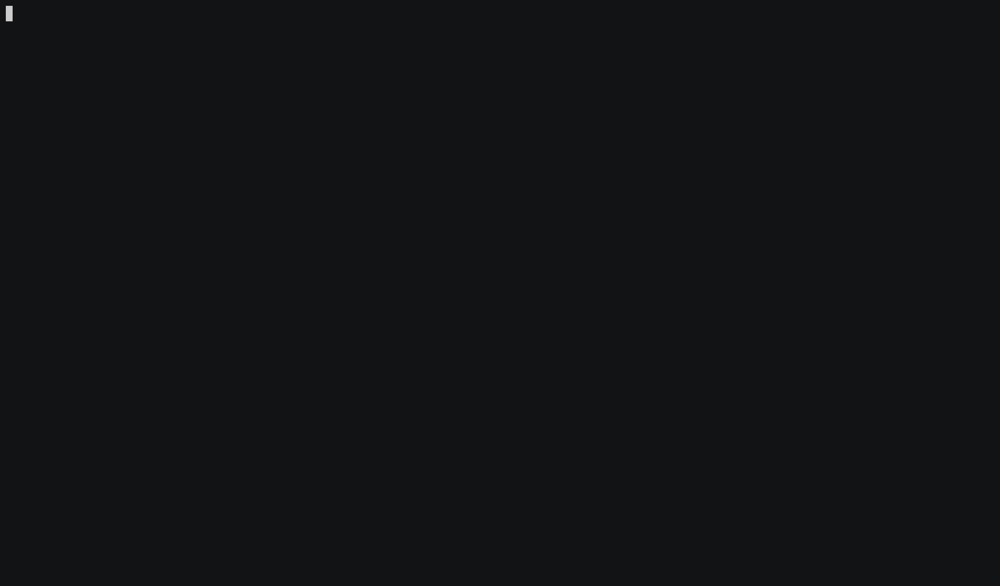

# AWSweeper

<p align="right">
  <a href="https://github.com/cloudetc/awsweeper/releases/latest">
    
  </a>
  <a href="https://travis-ci.org/cloudetc/awsweeper">
    
  </a>
  <a href="https://goreportcard.com/report/github.com/cloudetc/awsweeper">
    
  </a>
  <a href="https://godoc.org/github.com/cloudetc/awsweeper">
    
  </a>
  <a href="https://github.com/cloudetc/awsweeper/blob/master/LICENSE">
    
  </a>
</p>

AWSweeper wipes out all (or parts) of the resources in your AWS account. Resources to be deleted can be filtered by their ID, tags or
creation date using [regular expressions](https://golang.org/pkg/regexp/syntax/) declared in a yaml file (see [config.yml](example/config.yml)).

AWSweeper [can delete many](#supported-resources), but not all resources yet. Your help
supporting more resources is very much appreciated ([please read this issue](https://github.com/cloudetc/awsweeper/issues/21)
 to see how easy it is). Note that AWSweeper is based on the cloud-agnostic Terraform API for deletion - so it's planned to support
 deleting Azure and Google Cloud Platform resources soon, too.

Happy erasing!

[](https://asciinema.org/a/149097)

## Installation

It's recommended to install a specific version of awsweeper available on the
[releases page](https://github.com/cloudetc/awsweeper/releases).

Here is the recommended way to install awsweeper v0.6.0:

```bash
# install it into ./bin/
curl -sSfL https://raw.githubusercontent.com/cloudetc/awsweeper/master/install.sh | sh -s v0.6.0
```

## Usage

    awsweeper [options] <config.yml>

To see options available run `awsweeper --help`.

## Filtering

Resources to be deleted are filtered by a yaml configuration. To learn how, have a look at the following example:

    aws_instance:
      - id: ^foo.*
        tags:
          foo: bar
          bla: blub
        created:
          before: 2018-06-14
          after: 2018-10-28 12:28:39.0000
      - tags:
          foo: bar
         created:
           before: 2018-06-14
      - tags:
          foo: NOT(bar)
        created:
          after: 2018-06-14
    aws_iam_role:

This config would delete all instances which ID matches `^foo.*` *and* which have tags `foo: bar` *and* `bla: blub`
*and* which have been created between `2018-10-28 12:28:39 +0000 UTC` and `2018-06-14`. Additionally, it would delete instances
with tag `foo: bar` and which are older than `2018-06-14`.

Furthermore, this config would delete all IAM roles, as there is no list of filters provided for this resource type.

The general syntax of the filter config is as follows:

    <resource type>:
      # filter 1
      - id: <regex to filter by id> | NOT(<regex to filter by id>)
        tags:
          <key>: <regex to filter value> | NOT(<regex to filter value>)
          ...
        created:
          before: <timestamp> (optional)
          after: <timestamp> (optional)
      # filter 2
      - ...
    <resource type>:
      ...

A more detailed description of the ways to filter resources:

##### 1) All resources of a particular type

   [Terraform types](https://www.terraform.io/docs/providers/aws/index.html) are used to identify resources of a particular type
   (e.g., `aws_security_group` selects all resources that are security groups, `aws_iam_role` all roles,
   or `aws_instance` all EC2 instances).

   In the example above, by simply adding `security_group:` (no further filters for IDs or tags),
   all security groups in your account would be deleted. Use the [all.yml](./all.yml), to delete all (currently supported)
   resources.

##### 2) By tags

   You can narrow down on particular types of resources by the tags they have.

   If most of your resources have tags, this is probably the best to filter them
   for deletion. But be aware: not all resources support tags and can be filtered this way.

   In the example above, all EC2 instances are terminated that have a tag with key `foo` and value `bar` as well as
   `bla` and value `blub`.
   
   The tag filter can be negated by surrounding the regex with `NOT(...)`

##### 3) By ID

   You can narrow down on particular types of resources by filtering on their IDs.

   To see what the IDs of your resources are (could be their name, ARN, a random number),
   run awsweeper in dry-run mode: `awsweeper --dry-run all.yml`. This way, nothing is deleted but
   all the IDs and tags of your resources are printed. Then, use this information to create the yaml file.

   In the example above, all roles which name starts with `foo` are deleted (the ID of roles is their name).

   The id filter can be negated by surrounding the regex with `NOT(...)`

##### 4) By creation date

   You can select resources by filtering on the date they have been created using an absolute or relative date.

   The supported formats are:
   * Relative
     * Nanosecond: `1ns`
     * Microsecond: `1us`
     * Millisecond: `1ms`
     * Second: `1s`
     * Minute: `1m`
     * Hour: `1h`
     * Day: `1d`
     * Week: `1w`
     * Month: `1M`
     * Year: `1y`
   * Absolute:
     * RCF3339Nano, short dates: `2006-1-2T15:4:5.999999999Z07:00`
     * RFC3339Nano, short date, lower-case "t": `2006-1-2t15:4:5.999999999Z07:00`
     * Space separated, no time zone: `2006-1-2 15:4:5.999999999`
     * Date only: `2006-1-2`

## Dry-run mode

 Use `awsweeper --dry-run <config.yml>` to only show what
would be deleted. This way, you can fine-tune your yaml configuration until it works the way you want it to.

## Supported resources

AWSweeper can currently delete many but not [all of the existing types of AWS resources](http://docs.aws.amazon.com/AWSCloudFormation/latest/UserGuide/aws-template-resource-type-ref.html):

- aws_ami
- aws_autoscaling_group
- aws_cloudformation_stack
- aws_ebs_snapshot
- aws_ebs_volume
- aws_ecs_cluster
- aws_efs_file_system
- aws_eip
- aws_elb
- aws_iam_group
- aws_iam_instance_profile
- aws_iam_policy
- aws_iam_role
- aws_iam_user
- aws_instance
- aws_internet_gateway
- aws_key_pair
- aws_kms_alias
- aws_kms_key
- aws_launch_configuration
- aws_nat_gateway
- aws_network_acl
- aws_network_interface
- aws_rds_instance
- aws_route53_zone
- aws_route_table
- aws_s3_bucket
- aws_security_group
- aws_subnet
- aws_vpc
- aws_vpc_endpoint

Note that the above list contains [terraform types](https://www.terraform.io/docs/providers/aws/index.html) which must be used instead of [AWS resource types](http://docs.aws.amazon.com/AWSCloudFormation/latest/UserGuide/aws-template-resource-type-ref.html) to identify resources in the yaml configuration.
The reason is that AWSweeper is build upon the already existing delete routines provided by the [Terraform AWS provider](https://github.com/terraform-providers/terraform-provider-aws).

## Acceptance tests

***WARNING:*** Running acceptance tests create real resources that might cost you money.

Run all acceptance tests with

    make testacc

or use

    make testacc TESTARGS='-run=TestAccVpc*'

to test the working of AWSweeper for a just single resource, such as `aws_vpc`.

## Disclaimer

This tool is thoroughly tested. However, you are using this tool at your own risk! I will not take any responsibility if you delete any critical resources in your
production environments.
